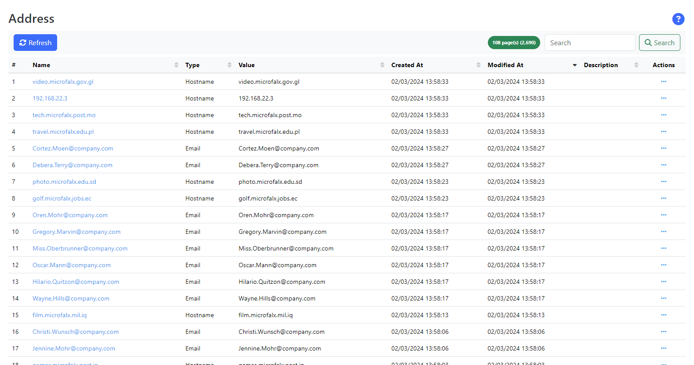
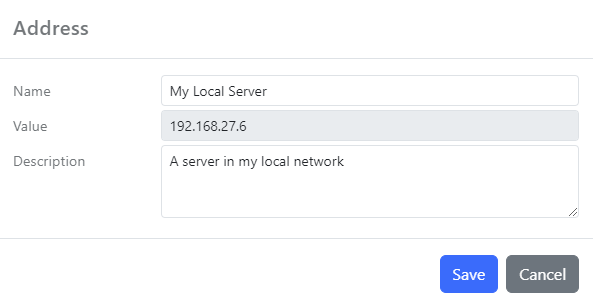

All protocols track the source or target _destination_ as an _address_. There are two types of addresses:

- `Hostname`: The hostname or the IP of the network address
- `Email`: The email address of a person

_Figure 1. Typical view of the Address dashboard_

The _Value_ field represents the value of the address (email, hostname/IP) received in the event and the _Name_ is derived from the original value. For some protocols, the address also can provide a friendly name (email address). However, the _Name_ of the address can be changed to something more user-friendly. Edit the entry and change the _Name_ field:

Dashboards will display the _Name_ field for an address and it should contain a value which is meaningful for the users.

