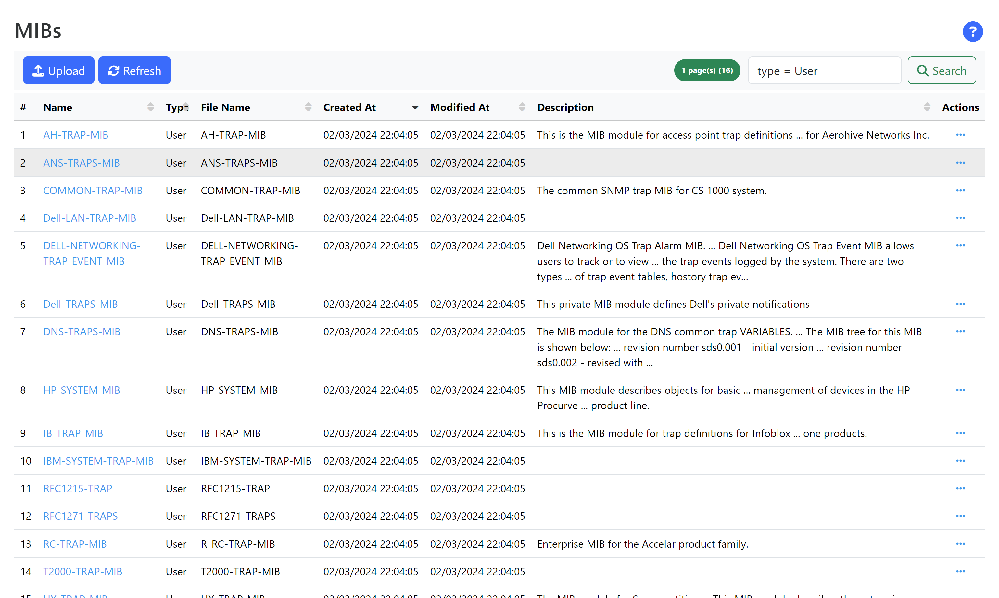
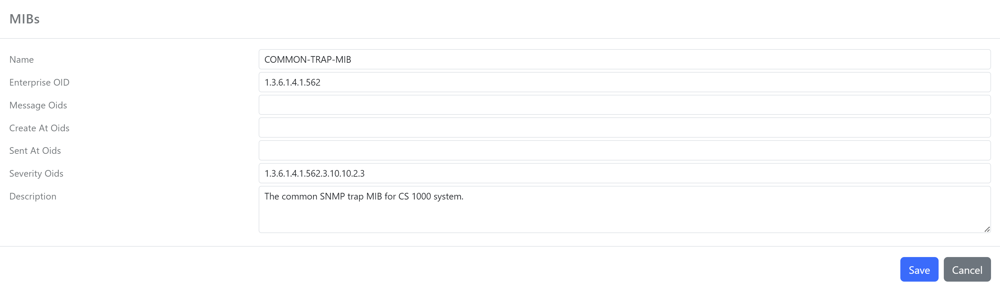

The SNMP MIB dashboard lists all MIBs registered with the _Heimdall_.

There are two types of MIBs:

- `System`: A MIB provided with _Heimdall_, which support most of the enterprise modules
- `User`: A MIB registered with the application, which usually provides en enterprise module used to decode the SNMP traps received by _Heimdall_

_Figure 1. Typical view of the SNMP MIB dashboard_

Information about a MIB (module) can be viewed by clicking on the MIB _Name_:

_Figure 1. Typical view of the SNMP MIB view_

The view displays the following information

- `Imports`: A list of module identifiers imported by the module
- `Variables`: A list of variables defined in the module; each of the displayed variables can send out with SNMP events
- `Symbols`: A list of symbols defined in the module
- `Content`: The original content used to create the module 

Each MIB has a few configurable properties which helps _Heimdal_ to convert the SNMP Trap to an event which can be stored and search. Select a MIB and _edit_ its properties:

_Figure 1. Typical view of the SNMP Edit view_

The following properties are available to be configured:

- `Message Oids`: A list of OIDs which will contain the message associated with an SNMP event (trap)
- `Create At Oids`: A list of OIDs which will contain the creation timestamp for an SNMP event (trap)
- `Sent At Oids`: A list of OIDs which will contain the timestamp when the SNMP event (trap) was sent out
- `Severity Oids`: A list of OIDs which will contain the severity of the SNMP event (trap)

Ideally, each of these are usually a single OID. However, some modules would have several of these types of OIDs and _Heimdal_ will use the first one (in the order of the definition) to retain one of the  SNMP event fields: message, created at, sent at, severity.

The OIDs can be extracted by looking at the bind variables available in the MIB.