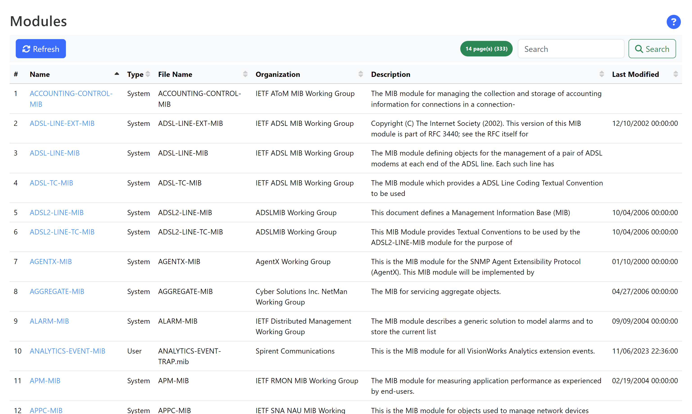
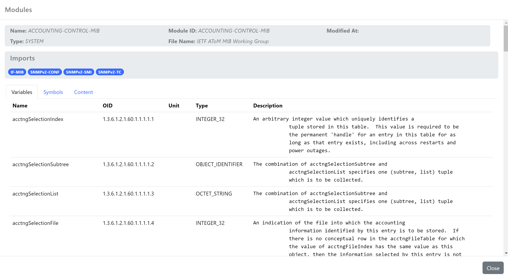

The SNMP Modules dashboard lists all modules registered with the application.

_Figure 1. Typical view of the SNMP Module dashboard_

Information about a module can be viewed by clicking on the module _Name_:

_Figure 1. Typical view of the SNMP Module dashboard_

The view displays the following information

- `Imports`: A list of module identifiers imported by the module
- `Variables`: A list of variables defined in the module; each of the displayed variables can send out with SNMP events
- `Symbols`: A list of symbols defined in the module
- `Content`: The original content used to create the module 

